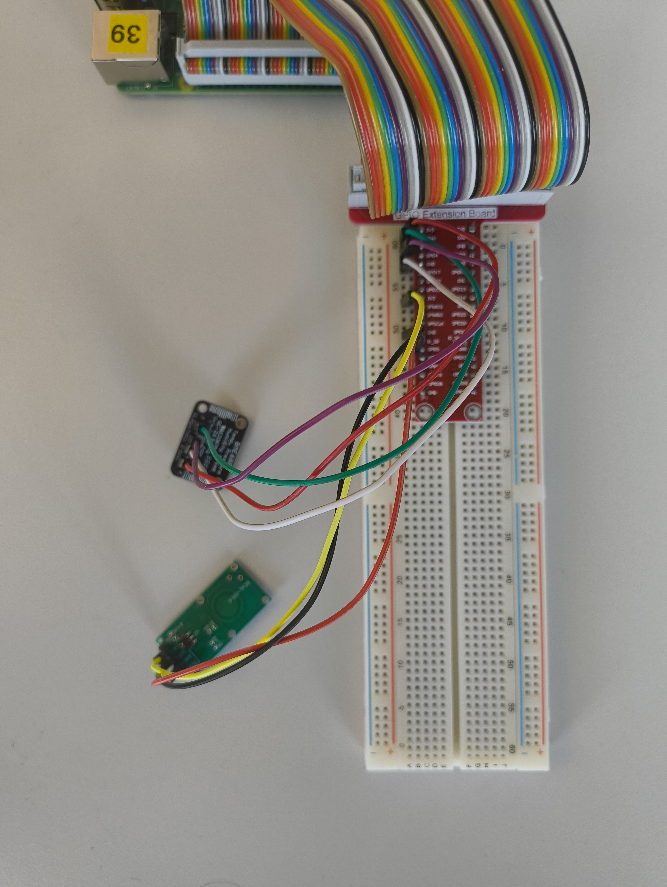
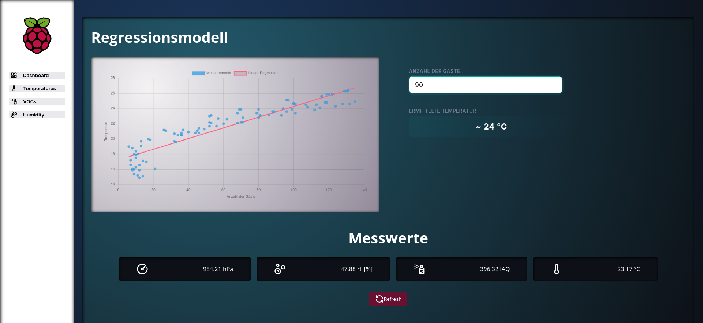
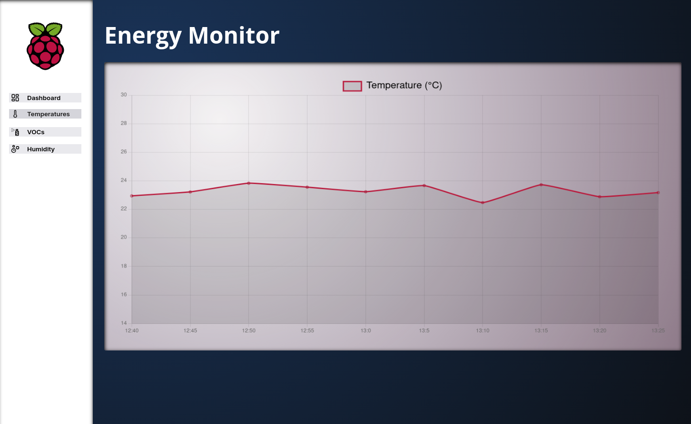

# Projektdokumentation

## Einleitung

### Projektbeteiligte:
- Philipp Müller
- Cedric Hintzen

### Link zum Git Repository
- https://github.com/MPhilippGit/GPIO-Manager

### Anforderungsprofil:
- Erfassung von Sensordaten:
    - BME680
    - RCWL-0516
- Automatisierte Datenpflege:
    - Auslesen der erfassten Daten alle 5 Minuten
    - Daten, welche älter sind als 30 Tage werden automatisiert gelöscht
- Weboberfläche mit Anzeige der aktuellen Daten
- Regressionsanalyse
- Fehlerlogs (Datenbank + Sensorausfälle)

### Verwendete Technologien zur Umsetzung des Anforderungsprofils:
- Systemarchitektur:
    - mariadb - Datenbank
    - Apache - Webserver
- Programmiersprachen:
    - Python v3.13 (Backend, Sensordaten, Datenbanktransaktionen, Regression)
    - JavaScript ES6+ (UI, Graphische Darstellung)
- Python Bibliotheken:
    - scikit-learn v1.8.0 - Regressionsanalyse
    - bme680 v2.0.0 - Sensorwerterfassung (bme680)
    - gpiozero v2.0.1 - Sensorwerterfassung (RCWL-0516)
    - mod-wsgi - Gateway für Apache Webserver
- JavaScript:
    - react v.19.2 - UI-Library
    - chart.js v.4.5.1 - Library für graphische Darstellung
    - lucide/react v0.563.0 Icon Library

## Umsetzungen der Kern-Features

### Aufbau



### 1. Erfassung von Sensordaten (BME680 & RCWL-0516)
Die Erfassung der Umweltdaten erfolgt über den BME680-Sensor, dessen Rohwerte (Gaswiderstand) in einen IAQ-Score umgerechnet werden. Parallel wird über den RCWL-0516 Radarsensor die Plausibilität der Messung (Anwesenheit/Bewegung) geprüft. Zur Systemerfassung werden beide Sensoren als Objekte instanziiert.

**BME680 IAQ Berechnung und Sensorerfassung (`GPIO/sensors/bme680.py`):**
```python
import time
import bme680


class BME680Data:
    """Wraps a single BME680 sensor and provides convenience methods.

    The constructor tries the primary I2C address first and falls back to
    the secondary address if the sensor is not found. After construction the
    sensor is configured with sensible oversampling and filter settings.
    """

    def __init__(self):
        # Try primary address first; fallback to secondary on error.
        try:
            self.sensor = bme680.BME680(bme680.I2C_ADDR_PRIMARY)
        except (RuntimeError, IOError):
            self.sensor = bme680.BME680(bme680.I2C_ADDR_SECONDARY)
        self.configure()

    def data_dump(self):
        """Return a dict of all public attributes from the sensor data object.

        Useful for debugging and initial inspection of sensor fields.
        """
        data_dict = {}
        for name in dir(self.sensor.data):
            value = getattr(self.sensor.data, name)
            if not name.startswith('_'):
                data_dict[name] = value
        return data_dict

    def set_data(self):
        """Sample the sensor for up to 15 seconds and populate attributes.

        This method prepares the gas measurement heater profile and then
        polls the sensor for up to 15 seconds. When `heat_stable` becomes
        True the IAQ value is computed and the instance is returned. If a
        stable VOC value cannot be established the method raises `IOError`.
        """
        self.prepare_voc_read()
        start = time.perf_counter()
        while time.perf_counter() - start < 15:
            if self.sensor.get_sensor_data():
                self.temperature = round(self.sensor.data.temperature, 2)
                self.pressure = round(self.sensor.data.pressure, 2)
                self.humidity = round(self.sensor.data.humidity, 2)
                if self.sensor.data.heat_stable:
                    # Convert gas resistance to a simple IAQ-like score.
                    self.voc = self.resistance_to_iaq()
                    return self
        # If no stable VOC reading after the timeout, indicate failure.
        raise IOError

    def resistance_to_iaq(self):
        """Convert raw gas resistance (Ohm) to a 0–500 IAQ-like score.

        The conversion clamps the gas resistance into a fixed range and maps
        that range linearly into 0..500 where higher scores indicate worse
        air quality. The mapping and clamping are project-specific heuristics.
        """
        if self.sensor.data.gas_resistance <= 0:
            return 500

        GAS_MIN = 5000     # very poor air quality
        GAS_MAX = 50000    # very good air quality

        # Clamp gas resistance into the expected interval.
        gas = max(min(self.sensor.data.gas_resistance, GAS_MAX), GAS_MIN)

        # Map clamped resistance into an IAQ-style score (0 best — 500 worst).
        iaq = 500 - ((gas - GAS_MIN) / (GAS_MAX - GAS_MIN) * 500)

        return round(iaq, 1)


    def to_dict(self):
        """Return the last-read measurement attributes as a plain dict.

        The shape matches what the rest of the application expects for
        storing or serializing sensor readings.
        """
        return {
            "temperature": self.temperature,
            "pressure": self.pressure,
            "voc": self.voc,
            "humidity": self.humidity
        }

    def configure(self):
        """Configure oversampling and filter settings for stable readings."""
        self.sensor.set_humidity_oversample(bme680.OS_2X)
        self.sensor.set_pressure_oversample(bme680.OS_4X)
        self.sensor.set_temperature_oversample(bme680.OS_8X)
        self.sensor.set_filter(bme680.FILTER_SIZE_3)

    def prepare_voc_read(self):
        """Enable gas measurement and set heater profile for VOC sampling."""
        self.sensor.set_gas_status(bme680.ENABLE_GAS_MEAS)
        self.sensor.set_gas_heater_temperature(320)
        self.sensor.set_gas_heater_duration(150)
        self.sensor.select_gas_heater_profile(0)
```

**RCWL Bewegungserkennung (`GPIO/sensors/rcwl.py`):**
```python
class RCWL:
    """Wrapper for the RCWL motion sensor hardware.

    The class attempts to initialise the sensor on GPIO pin 5. If
    initialisation fails the exception is logged — callers should handle
    a missing `self.sensor` attribute if they continue using the instance.
    """

    def __init__(self):
        try:
            self.sensor = MotionSensor(5)
        except Exception as e:
            logger = logging.getLogger(__name__)
            logger.error("Radar sensor initialization failed")


    def detect_motion(self, duration_s=10):
        """Wait up to `duration_s` seconds for motion and return a boolean.

        This convenience method uses `wait_for_active` under the hood which
        blocks until the sensor becomes active or the timeout elapses.
        It returns `True` if motion was detected within the timeout,
        otherwise `False`.
        """
        motion_detected = self.sensor.wait_for_active(timeout=duration_s)

        return bool(motion_detected)

    @staticmethod
    def check_sensor():
        """Interactive monitoring loop that prints activation events.

        Intended for manual debugging from a terminal: it attaches simple
        print callbacks to activation/deactivation events and then blocks on
        `pause()` until interrupted with Ctrl+C.
        """
        sensor = MotionSensor(5)
        try:
            while True:
                # Attach human-readable callbacks that include a timestamp.
                sensor.when_activated = lambda: print(f"[{datetime.now().strftime('%H:%M:%S')}] Bewegung erkannt!")
                sensor.when_deactivated = lambda: print(f"[{datetime.now().strftime('%H:%M:%S')}] Keine Bewegung mehr.")
                print("Warte auf Bewegung...")
                pause()
        except KeyboardInterrupt:
            print("Beende Monitoring...")
            pass

```

### 2. Automatisierte Datenpflege
Ein Django Management Command steuert das regelmäßige Auslesen und die persistente Speicherung der Daten. Zudem werden alte Datenstände entsprechend den Anforderungen automatisiert bereinigt. Alle dabei auftretenden Ereignisse werden in 'app.log' festgehalten. Bei Fehlern wie Abbrüchen der Datenbankverbindung oder der Sensorik generiert der Django-Logger neue Einträge über die Art der Fehler. 

**Datenbereinigung (`GPIO/models.py`):**
```python
def cleanup_entries(cls, timespan=30):
    # Entfernt Einträge, die älter als 30 Tage sind
    cutoff = timezone.now() - timezone.timedelta(days=timespan)
    result = cls.objects.filter(timestamp__lt=cutoff)
    deleted, _ = result.delete()
    return deleted
```

**Messvorgang (`GPIO/management/commands/measure.py`):**
```python
from GPIO.models import SensorValues
from GPIO.sensors.bme680 import BME680Data
from GPIO.sensors.rcwl import RCWL
from django.utils import timezone
import random
import logging


class Command(BaseCommand):
    # Short description shown in `manage.py help`.
    help = "Adds a sensor measurements to the database"

    def get_sensor_read(self):
        """Read the BME680 sensor and return a plain dict of values.

        This method constructs a `BME680Data` instance, triggers a short
        sampling sequence via `set_data()` and converts the result to a
        dictionary with `to_dict()` so it can be persisted.
        """
        handler = BME680Data()
        return handler.set_data().to_dict()

    def is_plausible(self):
        """Return a boolean indicating if the read is plausible.

        Uses the RCWL radar sensor to detect presence/motion. If motion is
        detected the reading is considered plausible. The method returns
        `True`/`False` accordingly.
        """
        radar_sensor = RCWL()
        return radar_sensor.detect_motion()

    def handle(self, *args, **options):
        """Main command entry point: read sensors and save to DB.

        The method logs a summary on success and logs the exception on any
        failure during reading or saving. Persistence is delegated to
        `SensorValues.save_values` (model-layer helper).
        """
        logger = logging.getLogger(__name__)
        try:
            data = self.get_sensor_read()
            data["is_plausible"] = self.is_plausible()
            data["timestamp"] = timezone.now()
            # Persist data using the model helper; keep persistence logic
            # in the model to maintain single responsibility.
            SensorValues.save_values(**data)
            logger.info("New data: {0} C, {1} hPa, {2} rH[%], {3} [IAQ]".format(
                data["temperature"],
                data["pressure"],
                data["humidity"],
                data["voc"]
            ))
        except Exception as error:
            # Log any exception during read/save so the scheduler can inspect
            # the log for problems.
            logger.error(f"{error} database operation failed")
```

### 3. Datenbank-Schnittstelle

Die Models aus der Django-Applikation können genutzt werden um einfach Endpunkte für den Datenabruf im Frontend abzubilden.

**Abrufbare-Urls (`GPIO/urls.py`):**
Im Django-Controller lassen sich sehr einfach Endpunkte deklarieren. Die Geschäftslogik ist dabei in den GPIO-models gekapselt.

```python
urlpatterns = [
    path("", views.index, name="home"),
    path("api/temps", views.fetch_temperatures, name="temps"),
    path("api/humids", views.fetch_humidities, name="humids"),
    path("api/vocs", views.fetch_vocs, name="vocs"),
    path("api/all", views.fetch_latest, name="latest"),
    path("api/regression", views.fetch_training_data, name="regression"),
    path("logs", views.fetch_log, name="log"),
    path('predict/guests/', views.predict_persons),
]
```

**Datenbereitstellung über Views (`GPIO/views.py`):**
Die Views dienen als API-Endpunkte, welche die Daten aus der Datenbank (oder aus Log-Dateien) abrufen und für das Frontend als JSON aufbereiten. Dabei werden Django-Features wie `annotate` genutzt, um Datenstrukturen zu vereinheitlichen.

**Beispiel: Abruf der aktuellsten Messwerte (`fetch_latest`):**
```python
def fetch_latest(request):
   """Gibt die aktuellste Sensormessung als JSON zurück."""
   data = SensorValues.objects.latest("timestamp")
   result = {
      "temperature": data.temperature,
      "humidity": data.humidity,
      "voc": data.voc,
      "pressure": data.pressure,
      "is_plausible": data.is_plausible,
      "timestamp": data.timestamp
   }
   return JsonResponse(result, safe=False)
```

**Beispiel: Abruf historischer Daten mit Abstraktion (`fetch_temperatures`):**
Um dem Frontend eine konsistente Datenstruktur zu liefern (unabhängig vom Datenbankfeld), wird das Feld `temperature` per Annotation auf `measurement` gemappt.
```python
def fetch_temperatures(request):
   """Gibt die letzten 10 Temperaturmessungen zurück."""
   data = list(SensorValues.objects.annotate(
      measurement=F("temperature")
   ).values("measurement", "timestamp", "is_plausible"))
   filter_data = data[-10:]
   return JsonResponse(filter_data, safe=False)
```

**Beispiel: Log-Dateien auslesen (`fetch_log`):**
Neben Datenbankinhalten werden auch System-Logs direkt eingelesen und strukturiert zurückgegeben.
```python
def fetch_log(request):
   """Liest die app.log aus und gibt die Einträge als JSON zurück."""
   logfile = BASE_DIR / "app.log"
   logcontent = []
   with logfile.open("r") as f:
      for line in f.readlines()[::-3]:
         linefields = line.split("|")
         logcontent.append({
            "level": linefields[0].strip(),
            "timestamp": linefields[1].strip(),
            "content": linefields[2].strip()
         })
   return JsonResponse(logcontent, safe=False)
```

### 4. Regressionsanalyse

**Schnittstelle für die Regression (`frontend/components/Prediction.jsx`):**
Die Ergebnisse im Frontend basieren auf einem Regressionsmodel welches mit Daten aus einer CSV-Datei angereichert wurde.  (R-Wert, Steigung und Y-Achsenabschnitt). Über die Klasse TemperatureRegressionModel hat man Zugriff auf den Zusammenhang von VOC-Werten zur Temperatur. Zusätzlich dazu ist es möglich mithilfe des VOCRegressionModels einen Zusammenhang zwischen Anzahl an Personen und dem VOC-Wert im Raum herzustellen.

```python
class VOCRegressionModel:
    """Linear model predicting estimated persons from VOC values.

    Attributes:
        FILE_REFERENCE: Path to the CSV file used to load training data.
        df: pandas DataFrame loaded from the CSV on initialization.
        model: Fitted `LinearRegression` instance.
        r2_score: Coefficient of determination for the fit.
    """

    FILE_REFERENCE = BASE_DIR / "trainingdata" / "basedata.csv"

    def __init__(self):
        # Load training data and train the model immediately.
        self.df = pd.read_csv(self.FILE_REFERENCE)
        self.model = LinearRegression()
        self.r2_score = None
        self._train()

    def _train(self):
        X = self.df[['persons_estimated']]
        y = self.df['temperature']

        # Fit the linear model on the whole dataset.
        self.model.fit(X, y)

        # Compute predictions on the training set and store R^2 score.
        y_pred = self.model.predict(X)
        self.r2_score = r2_score(y, y_pred)
        return self

    def _voc_to_person(self):
        X = self.df[['voc_value']]
        y = self.df['persons_estimated']

        self.person_model = LinearRegression()
        self.person_model.fit(X, y)
        self.person_model.predict(X)

        return {
            "slope": self.person_model.coef_[0],
            "intercept": self.person_model.intercept_
        }

    def get_r2_scrore(self):
        # Returns the stored R^2 score (method name kept for compatibility).
        return self.r2_score

    def get_slope(self):
        # Return the learned coefficient (slope) for the single-feature model.
        return self.model.coef_[0]

    def get_intercept(self):
        # Return the learned intercept of the linear model.
        return self.model.intercept_

    def get_training_data(self):
        """Read the CSV file and return a list of simple dicts for UI display.

        Each item contains the original VOC value and the target persons value.
        """
        training_data = []
        with self.FILE_REFERENCE.open("r") as file:
            file_data = csv.DictReader(file)

            for data_row in file_data:
                training_data.append({
                    "source": data_row["persons_estimated"],
                    "target": data_row["temperature"]
                })
        return training_data

class TemperatureRegressionModel:
    """Linear model predicting temperature from VOC values.

    This class mirrors `VOCRegressionModel` but uses `temperature` as the
    target column. The API is intentionally similar to keep usage consistent.
    """

    def __init__(self):
        # Read the same training CSV used by VOCRegressionModel.
        self.df = pd.read_csv(BASE_DIR / "trainingdata" / "basedata.csv")
        self.model = LinearRegression()
        self.r2_score = None
        self._train()

    def _train(self):
        X = self.df[['voc_value']]
        y = self.df['temperature']

        self.model.fit(X, y)

        y_pred = self.model.predict(X)
        self.r2_score = r2_score(y, y_pred)

    def get_r2_scrore(self):
        # Return the stored R^2 score for the temperature model.
        return self.r2_score

    def get_slope(self):
        return self.model.coef_[0]

    def get_intercept(self):
        return self.model.intercept_

    def predict_temperature(self, person_amount):
        prediction = self.model.predict([[person_amount]])[0]

```

Die Ergebnisse dieser Analyse werden mithilfe einer View bereit gestellt und im Frontend graphisch dargestellt. Des weiteren wurde ein System implementiert um basierend auf der Gästeanzahl die geschätzte Temperatur zu ermitteln.

**Vorhersage-Logik (`frontend/utils/prediction.js`):**
```javascript
class PredictionHelper {
    constructor(slope, intercept) {
        this.slope = slope;
        this.intercept = intercept;
    }

    predict(x) {
        // Lineare Regression: y = m * x + b
        return this.slope * x + this.intercept;
    }
    /**
     * 
     * @param data array of person count from the regression data
     * @returns an array of corresponding xy-pairs to visualize the regression line  
     */
    getXYValues(data) {
        return data.map(x => [parseFloat(x), this.predict(x)])
    }
}
```

**UI-Integration der Vorhersage (`frontend/components/Prediction.jsx`):**
```javascript
const yValue = useMemo(() => {
    if (xValue === "") return "";
    let result = Math.round(slope * parseInt(xValue, 10) + intercept);
    if (result > 36) result = "36 (Maximalwert)"
    return result 
}, [xValue, slope, intercept]);
```

### 5. Weboberfläche (React Dashboard)
Das Frontend basiert auf React und ruft die aktuellen Messwerte über eine API ab, um sie visualisiert darzustellen.

**Datenabruf im Dashboard (`frontend/components/Dashboard.jsx`):**
```javascript
const fetchLatest = async (endpoint) => {
    try {
        const response = await fetch(endpoint);
        const result = await response.json();
        setLatest(result);
    } catch (error) {
        console.error(error.message);
        setLatest([]);
    }
};
```





## Build- & Deployment-Prozess
Um Python Backends mit Apache auszugeben benötigt es weitere Module. 

### 1) Vorbereitung & Sync
- Damit das Deployment-Skript funktioniert muss gewährleistet sein, dass ein entsprechender Ordner mit den richtigen Rechten existiert 
```bash
sudo mkdir /var/www/GPIO
sudo chown -R "$USER:$USER" /var/www/GPIO
```

### 2) Deployment Skript ausführen
- Erst muss das Skript ausführbar gemacht werden
```bash
sudo chmod +x ./deploy.sh
```
- Ausführen startet den sync Prozess 
```bash
sudo chmod +x ./deploy.sh
```

### 3) Updates 
- neue Änderung aus dem Repo pullen mit git pull
- deploy.sh ausführen
```
---