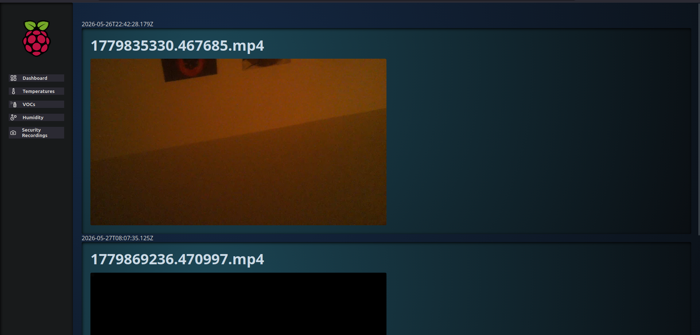

# Sicherheitsaufnahmen (PIR-gesteuerte Videoerfassung)

Bei erkannter Bewegung durch einen PIR-Sensor wird automatisch ein 10-Sekunden-Video über die Raspberry Pi Kamera aufgezeichnet, auf dem Dateisystem gespeichert, in der Datenbank registriert und über das Frontend abrufbar gemacht.

## Ablauf

```
PIR-Sensor (GPIO-Pin 24)
    ↓  Bewegung erkannt
scripts/pir_monitor.py
    ↓  startet Subprocess
python manage.py videosave
    ↓  scripts/save_mp4.py (picamzero, 10 Sek.)
media/videos/{timestamp}.mp4
    ↓  DB-Eintrag
Recordings-Modell
    ↓  /videos API
React Recordings-Komponente
```

## Screenshots

### Hardware-Aufbau / Verkabelung


### Web-Interface – Dashboard


### Web-Interface – Messwerte


### Web-Interface – Aufnahmen (aktuell)



---

## PIR-Sensor Daemon (`scripts/pir_monitor.py`)

Der Daemon wartet kontinuierlich auf ein Signal des PIR-Sensors (GPIO-Pin **24**). Bei Bewegungserkennung wird der als Argument übergebene Befehl als Subprocess gestartet. Nach jeder Auslösung folgt ein 20-Sekunden-Debounce, um Mehrfachaufnahmen zu vermeiden. Das Skript wird über `runpir` aufgerufen und läuft im Hintergrund.

```python
from gpiozero import MotionSensor

def main():
    command = sys.argv[1:]
    pir = MotionSensor(24)

    def on_motion():
        subprocess.Popen(command)

    pir.when_motion = on_motion

    while True:
        pir.wait_for_active()
        print("Active")
        time.sleep(20)  # Debounce: 20 Sekunden Pause nach jeder Auslösung
```

## Videoaufnahme (`scripts/save_mp4.py`)

Nimmt über `picamzero` ein 10-Sekunden-Video auf und speichert es unter dem übergebenen Dateipfad. Wird von `videosave` als Subprocess aufgerufen.

```python
from picamzero import Camera

def main():
    filename = sys.argv[1]
    cam = Camera()
    cam.record_video(filename, duration=10)
```

## Django Management Command `runpir` (`GPIO/management/commands/runpir.py`)

Einstiegspunkt für den Betrieb des PIR-Daemons. Nimmt einen beliebigen Folgebefehl als Argument entgegen, baut daraus einen vollständigen Python-Aufruf (mit `settings.INTERPRETER` und `manage.py`) und übergibt ihn an `pir_monitor.py`.

```python
class Command(BaseCommand):
    help = "Run PIR motion sensor and trigger a command on detection"

    def handle(self, *args, **options):
        command = [str(settings.INTERPRETER), "manage.py", *options["cmd"]]
        self.stdout.write(f"Listening for motion. On detection: {' '.join(command)}")
        subprocess.run(["python3", str(SCRIPTS / "pir_monitor.py"), *command])
```

**Aufruf:**

```bash
python manage.py runpir videosave
```

## Django Management Command `videosave` (`GPIO/management/commands/videosave.py`)

Erzeugt einen Unix-Timestamp-Dateinamen, ruft `scripts/save_mp4.py` als Subprocess auf und speichert anschließend den Dateinamen mit aktuellem Zeitstempel in der Datenbank.

```python
class Command(BaseCommand):
    def handle(self, *args, **options):
        output_dir = Path(settings.MEDIA_ROOT) / "videos"
        output_dir.mkdir(parents=True, exist_ok=True)
        filename = str(timezone.now().timestamp()) + ".mp4"
        output_file = output_dir / filename

        cmd = [
            str(settings.BASE_DIR / "scripts" / "save_mp4.py"),
            str(output_file),
        ]

        result = subprocess.run(cmd, check=True, capture_output=True, text=True)

        recording = Recordings(timestamp=timezone.now(), filename=filename)
        recording.save()
```

## Datenbankschema (`GPIO/models.py`)

Das Projekt verwendet zwei Datenbanktabellen.

### `SensorValues` – Sensormesswerte

| Feld | Typ | Beschreibung |
|---|---|---|
| `id` | BigAutoField (PK) | Primärschlüssel |
| `voc` | DecimalField(10, 2) | VOC-Gaswert (IAQ-Score 0–500) |
| `pressure` | DecimalField(10, 2) | Luftdruck in hPa |
| `temperature` | DecimalField(10, 2) | Temperatur in °C |
| `humidity` | DecimalField(10, 2) | Relative Luftfeuchtigkeit in % |
| `is_plausible` | BooleanField | Plausibilitätsflag |
| `timestamp` | DateTimeField | Zeitstempel der Messung |

```python
class SensorValues(models.Model):
    voc = models.DecimalField(max_digits=10, decimal_places=2)
    pressure = models.DecimalField(max_digits=10, decimal_places=2)
    temperature = models.DecimalField(max_digits=10, decimal_places=2)
    humidity = models.DecimalField(max_digits=10, decimal_places=2)
    is_plausible = models.BooleanField()
    timestamp = models.DateTimeField()
```

### `Recordings` – Videoaufnahmen

| Feld | Typ | Beschreibung |
|---|---|---|
| `id` | BigAutoField (PK) | Primärschlüssel |
| `filename` | CharField(255, unique) | Dateiname der MP4-Datei (Unix-Timestamp) |
| `timestamp` | DateTimeField | Zeitstempel der Aufnahme |

```python
class Recordings(models.Model):
    filename = models.CharField(max_length=255, unique=True)
    timestamp = models.DateTimeField()
```

## API-Endpunkt (`GPIO/views.py` + `GPIO/urls.py`)

```python
# views.py
def fetch_videos(request):
    recordings = list(Recordings.objects.all().values())
    return JsonResponse(recordings, safe=False)

# urls.py
path("videos", views.fetch_videos),
```

## Frontend-Integration

Die React-Komponente `Recordings.jsx` ruft beim Laden den `/videos`-Endpunkt ab und rendert für jeden Eintrag eine `VideoPlayer`-Komponente mit HTML5-Videosteuerung. Die Videodateien werden über den Django-Media-Server unter `/media/videos/{filename}` bereitgestellt. Die Navigation erfolgt über die Sidebar-Schaltfläche „Security Recordings".

---

## `scripts/`-Verzeichnis – Übersicht

| Skript | Funktion | GPIO / Interface |
|---|---|---|
| `pir_monitor.py` | PIR-Bewegungsdaemon, löst Subprocess aus | GPIO-Pin 24 (gpiozero) |
| `save_mp4.py` | 10-Sekunden-Videoaufnahme via picamzero | Raspberry Pi Kamera |
| `picam_record.py` | Alternative Videoaufnahme via picamzero | Raspberry Pi Kamera |
| `bme680_read.py` | BME680-Sensorauslesung: Temp., Druck, Feuchte, VOC | I2C |
| `rcwl_detect.py` | RCWL-0516 Radar-Bewegungssensor | GPIO-Pin 5 (gpiozero) |

## Aufnahme manuell starten

```bash
python manage.py runpir videosave
```
